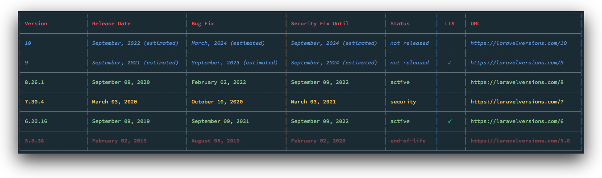

<h1 align="center">
    
</h1>

<h1 align="center">
    
</h1>

## Introduction

Laravel Versions CLI provides a simple cli interface to laravel version information provided by [Laravel Versions Website](https://laravelversions.com)

## Installation

Using npm

```bash
> npm install -g @codedungeon/laravel-versions-cli
```

Using yarn

```bash
> yarn add global @codedungeon/laravel-versions-cli
```

## Usage

Laravel Versions CLI can be executed using `laravel-versions-cli` or `lv` which was created during installation.
For more information, please refer to the [options](#options) section below

_Note: You may have an existing `lv` alias in your bash aliases which could override the `lv` alias_

```bash
laravel-versions-cli info
```

or using `lv` alias

```bash
lv info
```

## Options

```bash
🚧 laravel-versions-cli vX.X.X build XX
   Crafted with love by Mike Erickson ((https://github.com/mikeerickson))


🛠  info
   Get version information for all Laravel projects

Usage:
  laravel-versions-cli info <options>

Options:
  --versions, -s          Versions (multiple separate with comma) [default: v5, v6, v7, v8]
  --limit, -l             Limit number of returned items [default: 4 last major releases]
  --showFuture, -f        Show Future Releases [default: true]

Examples:
  laravel-versions-cli info
  laravel-versions-cli info --versions 8
  laravel-versions-cli info --product laravel --limit 5
  laravel-versions-cli info --product laravel,lumen
  laravel-versions-cli info --list
```

### Flags

| Flag        | Alias | Type    | Description                                                    | Default      |
| ----------- | ----- | ------- | -------------------------------------------------------------- | ------------ |
| versions    | s     | string  | which version(s) you wish to show (values separated by comma)  | all versions |
| limit       | l     | number  | limits number of returned rows (not including future releases) | 4            |
| show-future | f     | boolean | show future releases                                           | true         |

### Examples

**Show only versions 7 and 8**

```bash
laravel-versions-cli info --versions 7,8
```

**Show only last 4 major major**

```bash
laravel-versions-cli info --limit 4
```

**Show only last 10 releases**

```bash
laravel-versions-cli info --limit 10
```

**Don't inlcude future releases**

```bash
laravel-versions-cli info --show-future false
```

## License

Copyright &copy; 2021 Mike Erickson
Released under the MIT license

## Credits

laravel-versions-cli written by Mike Erickson

E-Mail: [codedungeon@gmail.com](mailto:codedungeon@gmail.com)

Issues: [https://github.com/mikeerickson/laravel-versions-cli](https://github.com/mikeerickson/laravel-versions-cli/issues)

Twitter: [@codedungeon](http://twitter.com/codedungeon)

Website: [codedungeon.io](http://codedungeon.io/gunner)
